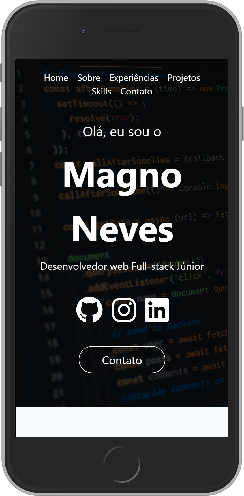

    

<h4 align = center>Portfolio dos projetos que já desenvolvi e fiz participações ao longo da minha atuação como desenvolvedor. Além de listar e contar um pouco sobre cada projeto, há também seções em que falo um pouco mais sobre mim e minhas qualificações como profissional.
</h4>

 

    <a href = "#computer-tecnologias">Tecnologias</a> | <a href= "#information_source-como-usar">Como usar</a>

 

    

 

  <a style="padding: 20px; background-color: gray; color: white; border-radius: 20px; font-size: 1em; " href="https://portfolio-magao.netlify.app" target="_blank">Acesse o portfolio</a>

 

### :computer: Tecnologias

Esse projeto foi desenvolvido durante um módulo da <a href = "https://www.fabricadecodigo.com" target="_blank">Fábrica de Código</a> com as seguintes tecnologias:

- <a href = "https://www.gatsbyjs.com/get-started/" target="_blank">GatsbyJS</a>
- <a href = "https://pt-br.reactjs.org/docs/getting-started.html" target="_blank">ReactJs</a>
- <a>JavaScript</a>
- <a>HTML</a>
- <a href = "https://sass-lang.com/documentation/syntax" target="_blank">SCSS</a>
- <a href = "https://tailwindcss.com/docs/installation" target="_blank">TailwindCSS</a>
- <a href = "https://code.visualstudio.com" target="_blank">VS Code</a>

### :information_source: Como Usar

Para clonar e executar esse projeto, você precisará do <a href = "https://git-scm.com" target="_blank">Git</a>, <a href = "https://nodejs.org/pt-br/" target="_blank">Node.js</a> + <a href = "https://classic.yarnpkg.com/pt-BR/docs/getting-started" target="_blank">YARN</a> instalado no seu computador. Entre com as seguintes linhas de comando no seu terminal:

<h4 align = center>Rodando o projeto localmente</h4>

~~~
- Clone este repositório
$ git clone https://github.com/MagnoNeves2/portfolio.git

- Vá para o repositório
$ cd portfolio/

- Instalar dependências
$ yarn install

- Execute o projeto
$ yarn start
~~~

---

#### Feito com :heart: por <a href = "https://www.linkedin.com/in/magnoneves/" target="_blank">Magno</a>.